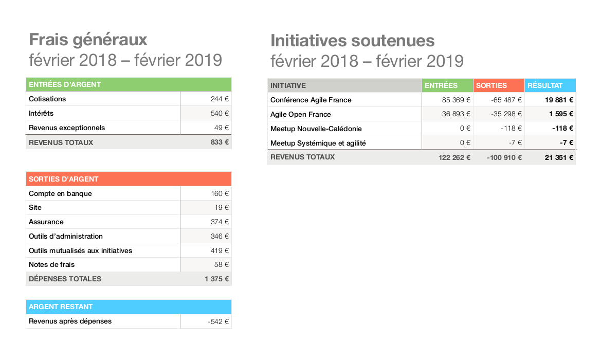

Sont présent·e·s :

- Bénédicte Taillebois
- Christophe Robillard (à distance)
- Frédéric André
- Julie Quillé
- Julien De Santis
- Matti Schneider
- Raphaël Pierquin

Sont representé·e·s :

- Julien Porot (par Julie Quillé)

# Nomination d'un·e président·e de séance, d’un·e secrétaire de séance (ou plusieurs) et maîtres‧ses du temps

 - Julie Quillé est nommée présidente de séance.
 - Raphaël Pierquin est nommé secrétaire de séance.
 - Bénédicte Taillebois est nommée maîtresse du temps.

# Ordre du jour

- Rapport moral
- Rapport financier
- Élection du nouveau bureau
- Projets 2020 et budget prévisionnel
- Prise de parole des initiatives
- Point sur Conférence Agile France
- Règlement intérieur
- Questions diverses

L'odre du jour est accepté à l'unanimité.

# Rapport moral

## Nouvelles initiatives

### ParisTestConf

L'équipe a découvert l'association par un ancien adhérent (point de contact : Lucie Duchemin)

Conférence consacrée aux tests dans le développement logiciel.

Première édition de l'événement.

Salle comble avec 150 participant‧e‧s (le bureau avait poussé à un point d'équilibre à 100 participant‧e‧s).

L'équipe n'a pas encore décidé de manière définitive si elle voulait renouveler l'événement, ni si elle voulait solliciter à nouveau le soutien de l'association ou non.
L'équipe d'orga s'est dite très satisfaite du soutien de l'asso. Elle aurait aimé avoir plus d'échange avec d'autres équipes d'organisation pour obtenir des conseils.

Résultat financier : 7 372 euros d'excédent.

## Initiatives soutenues à nouveau

### Agile Open France

Deux événements (hiver, été), dans les mêmes lieux que l'année précédente.

Tension autour du processus d'invitation car pas d'augmentation du nombre de places à l'événement d'hiver. Diverses tentatives pour le rendre plus fluide.

Le processus d'invitation est un point délicat chaque année, et ce depuis la création de l'événement car elle montre la tension entre inviter des personnes connues et de nouvelles personnes.

Deuxième édition de l'événement estival, dans la Ferme des Cévennes. Moins de participant‧e‧s que l'année précédente. Le lieu ne sera pas renouvelé, en raison d'un rapport qualité-prix défavorable.

Inquiétudes à cause de l'outil de paiement des billets, qui n'a pas versé près de 7000€. La réalisation de ce non-versement a été tardive et il a fallu plusieurs mois pour les recouvrer. Cet outil ne sera pas renouvelé.

### Conférence Agile France

Objectifs saillants 2019 :

- Pousser les murs du chalet. La contrainte : nombre d'hôtes pendant les repas. Solution : utiliser la fermette pour servir des repas.
- Utiliser les cerveaux présents pour produire des choses utiles « au bien commun », à travers un « éducathon ». Les retours ont été positifs.

## Initiatives sortantes

### Agile Open France

Départ en autonomie (sans demande de soutien à l'association Agile France) pour l'événement hiver, a priori avec la même équipe d'organisation dans une nouvelle association.

AOF été n'est pas encore certain d'exister cette année. Raphaël envisage de créer un autre événement en plus ou à la place, qui fera peut-être l'objet d'une demande de soutien.

## Autres sollicitations

Aucune autre cette année.
Les modalités de soutien on été décrite sur le [site de l'association](https://agile-france.org/).
Des questions restent ouvertes autour de la représentation de l'association pendant les événements soutenus.

Une subvention de 1000 euros a été accordée à l'initiative Mobilizon, comme voté lors de l'AGX de juin 2019.

## Relation avec les adhérent‧e‧s

- Expérimentation concluante sur la gestion des adhésions avec Assoconnect.
- Expérimentation pas encore concluante pour les décisions avec Framavox. On continue cette année.
- Systématisation de l'utilisation de Lydia pour simplifier les frais des organisateurices. On a constaté que ça a amélioré l'automie des équipes d'orga. Le fait que Lydia facilite aussi le travail comptable ne fait pas encore consensus.

## Administration interne

- Transition vers AssoConnect terminée pour la compta.
- Le nouveau bureau pourra partir uniquement sur AssoConnect et n'aura pas besoin de connaître Xero.
- Modernisation des statuts par l'AGX : élargissement de la mission, diminution du pouvoir du bureau, simplification des modalités d'adhésion, rigidification des conditions de dissolution.
- Itération sur un template de réponse aux demandes de soutiens.

## Approbation du bilan moral

Le bilan moral est approuvé à l'unamité.

# Rapport financier

Frais de fonctionnement négligeables.

Bilan global des événements excédentaire.

La trésorerie de l'association continue de gonfler.

Le bilan financier est approuvé à l'unanimité.

# Élection du nouveau bureau

- Bénédicte Taillebois
- Christophe Robillard
- Julie Quillé
- Julien Porot
- Matti Schneider

## Bilan personnel du mandat par Matti

Ce mandat de deux ans a permis d'obtenir de bons résultats en valeur relative et je suis convaincu que l'association est en meilleure santé maintenant. Pour autant, je trouve que les résultats ont une valeur absolue faible et ne sont pas à la hauteur de l'ambition que je portais. Intention claire, vision identique, mais beaucoup d'énergie passée à gérer les affaires courantes et rembourser de la dette.

Deux points délicats :

1. Le rapport à l'argent dans cette association. Quand je suis au chômage on me dit que je ne dois pas être defrayé pour mon temps, quand je travaille je n'ai plus de temps à consacrer.
2. L'engagement des membres du bureau. Mission pas très claire, travail plutôt organisé sous la forme de sessions courtes et irrégulières, mais pas de colocalisation donc difficile de travailler ensemble et de transférer des compétences.

J'avais annoncé deux métriques d'impact :

- Nombre de personnes touchées.
- Proportion ne provenant pas du développement logiciel.

Mais nous n'avons pas mis en place les outils de mesure nécessaires pour pouvoir les suivre au-delà du nombre de participant‧e‧s aux événements. Je ne peux donc pas présenter de bilan précis sur ce sujet 🙁

## Profession de foi du bureau actuel pour une réelection

[Profession de foi de renouvellement à la candidature du bureau d’AgileFrance en 2020](/bureau/2020).

## Vote

Une seule équipe se présente, mais on fait quand même l'exercice, histoire de se familiariser au nouveau mode de scrutin : le [jugement majoritaire](http://jugementmajoritaire2017.com)

L'équipe obtient 1 assez bien, 5 bien, 2 très bien. La mention majoritaire pour cette équipe est donc « bien ».

# Règlement intérieur

Pas le temps d'aborder des suggestions de modification en séance. Les changements devant être validés par une AG depuis le changement de statut, la discussion est remise à une séance ultérieure.

# Questions diverses

## Frédéric André (Conférence Agile France)

- Quelles seraient les attentes des membres de l'association pour la dixième édition de la conférence ? Vos avis idées, suggestions, propositions, à titre informatif à communiquer à l'équipe d'orga.
- Quelle serait la position (globale, si consensus il peut y avoir) sur les billets solidaires de la conférence 2020 : nombre? Coût (pour les participants)? Conditions pour y avoir droits et contrôles associés (le cas échéant)? Là encore je suis curieux d'avoir les avis des membres de l'association pour transmettre au groupe d'orga de la conf.

Vu le temps restant, l'assemblée décide de traiter ces questions sous la forme d'échanges asynchrones sur Loomio.

## Raphaël Pierquin (porteur de projet)

Envie de diversifier l'accès aux événements type AOF, mais pas d'idée de comment faire pour ne pas refaire un événement qui rassemble une communauté déjà privilégiée. Le cas échéant, le soutien de l'association pourra être utile.

## Raphaël Pierquin (/ut7)

Propose d'ouvrir un dialogue en vue d'améliorer l'usage de la boutique /ut7 : comment chercher et déposer du matériel, gestion du courrier postal (l'association étant actuellement hébergée chez /ut7).

# Clôture de l'AG à 12h35
